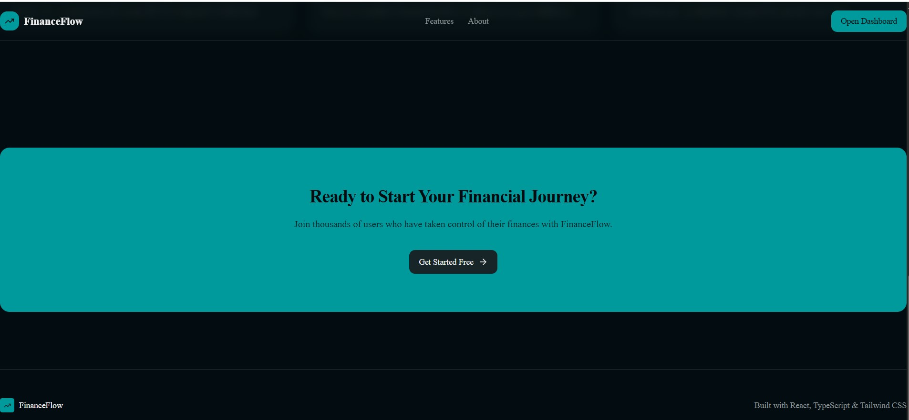
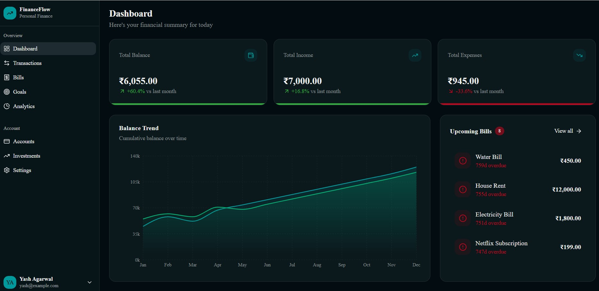
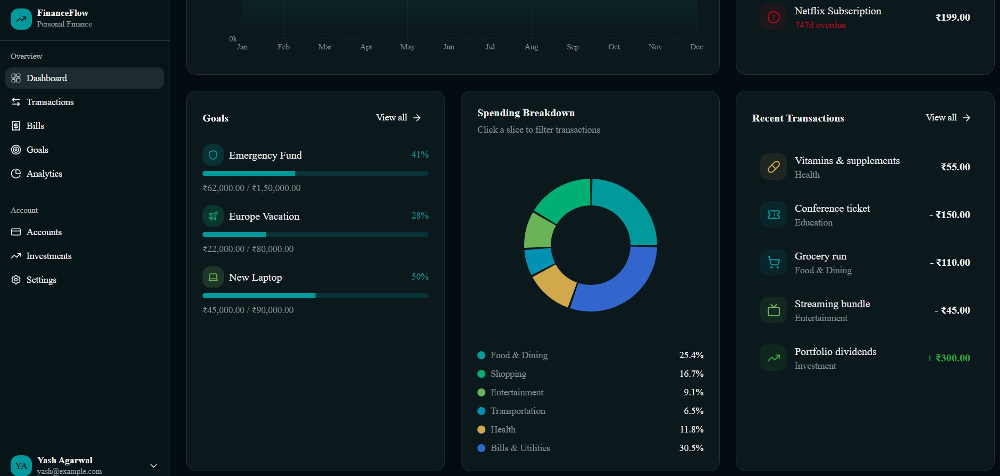
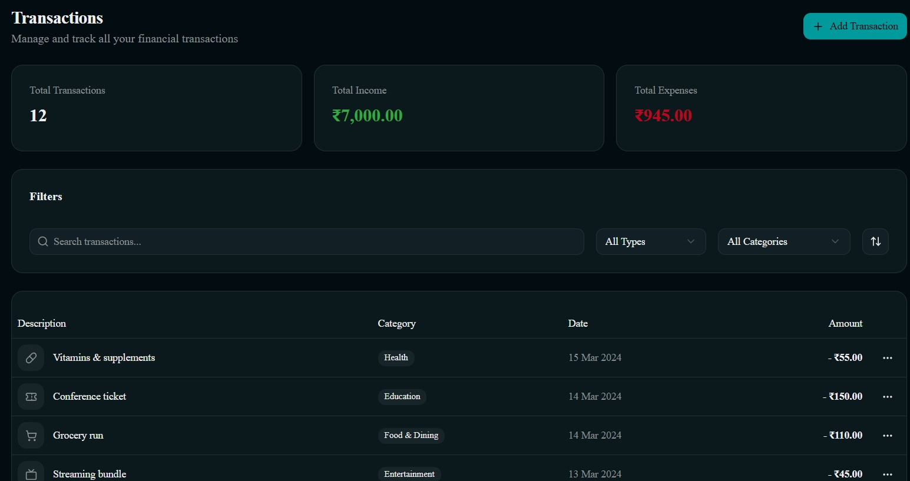
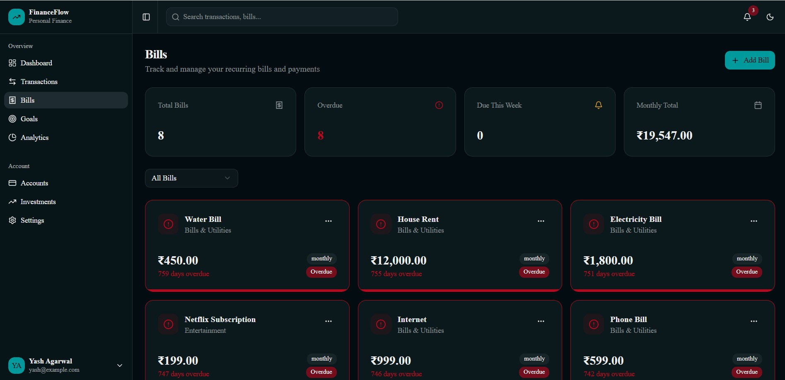
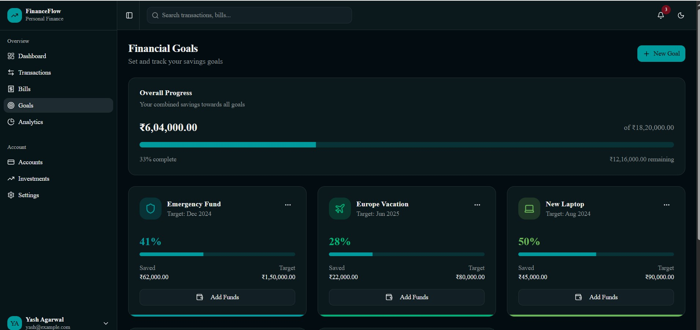
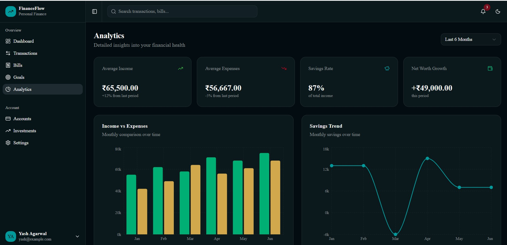
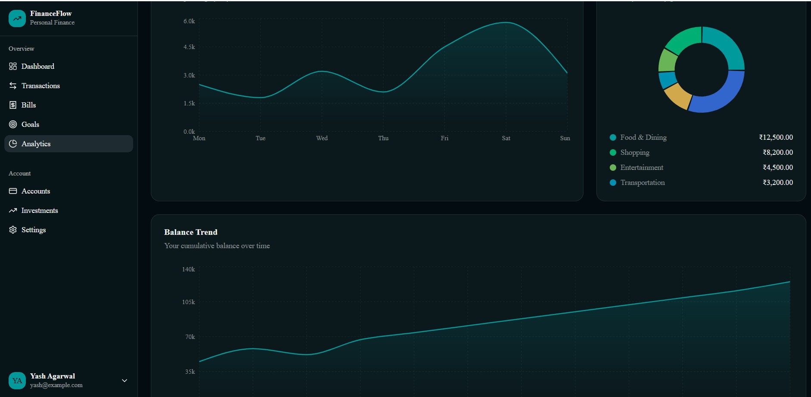
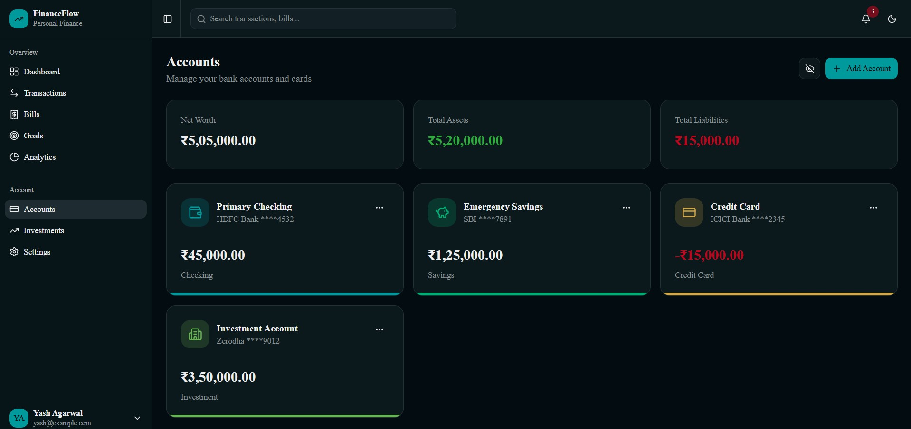
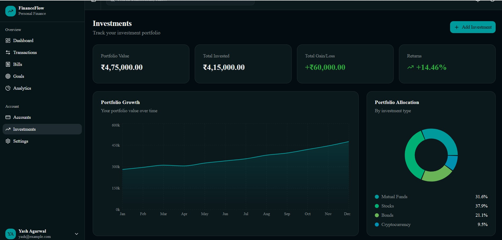

<!-- 🔥 Animated Header -->
<p align="center">
  
</p>

<!-- 🔥 Typing Animation -->
<p align="center">
  
</p>

<!-- 🔥 Badges -->
<p align="center">
  
  
  
  
  
</p>

---

# 💰 FinanceFlow – Smart Personal Finance Dashboard  

## 📌 Zorvyn Assignment  

This project is developed as part of a **technical assignment for Zorvyn Company**.  

It showcases:
- ⚛️ Modern React architecture  
- 🎨 Clean and responsive UI  
- 📊 Data visualization dashboards  
- 🧠 Scalable frontend structure  

---

## 🌐 Live Demo  

🚀 https://v0-financial-dashboard-project-five.vercel.app/

---

## 📖 About the Project  

FinanceFlow is a modern financial dashboard that helps users manage and visualize their financial data.

Users can:
- Track income & expenses  
- Manage bills  
- Monitor goals  
- Analyze spending  
- View investments  

---

## ✨ Features  

- 📊 Dashboard overview  
- 💸 Transactions management  
- 🧾 Bills tracking  
- 🎯 Goals progress  
- 📈 Analytics charts  
- 🏦 Accounts & net worth  
- 💼 Investments  

---

## 🎨 UI Highlights  

- 🌙 Dark mode design  
- ⚡ Smooth UI experience  
- 📱 Responsive layout  
- 🧩 Reusable components  

---

## 🛠️ Tech Stack  

<p align="center">
  
</p>

| Category | Technology |
|----------|-----------|
| Frontend | React |
| Language | TypeScript |
| Styling | Tailwind CSS |
| Charts | Recharts |
| Deployment | Vercel |

---

## 📸 Screenshots (Portfolio View)

<table>
<tr>
<td></td>
<td></td>
</tr>

<tr>
<td></td>
<td></td>
</tr>

<tr>
<td></td>
<td></td>
</tr>

<tr>
<td></td>
<td></td>
</tr>

<tr>
<td></td>
<td></td>
</tr>
</table>

---

## ⚙️ Getting Started  

### 📋 Prerequisites  
- Node.js (v18+)  
- npm  

---

### 🔧 Installation  

```bash
git clone https://github.com/your-username/financeflow.git
cd financeflow
npm install
npm run dev
````
hi

